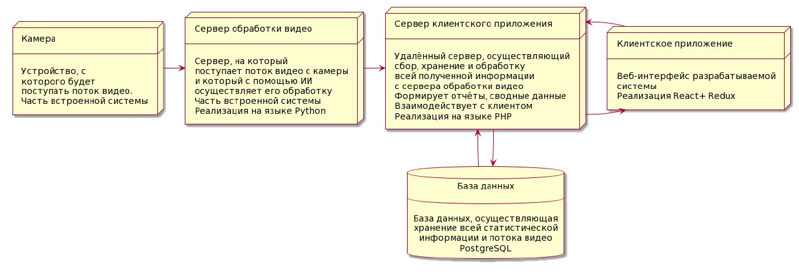
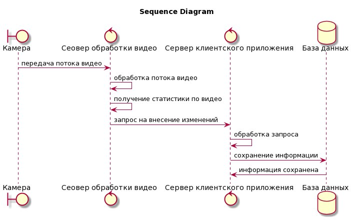
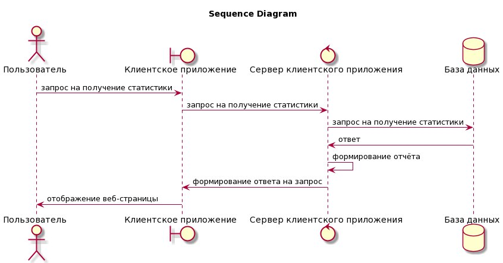
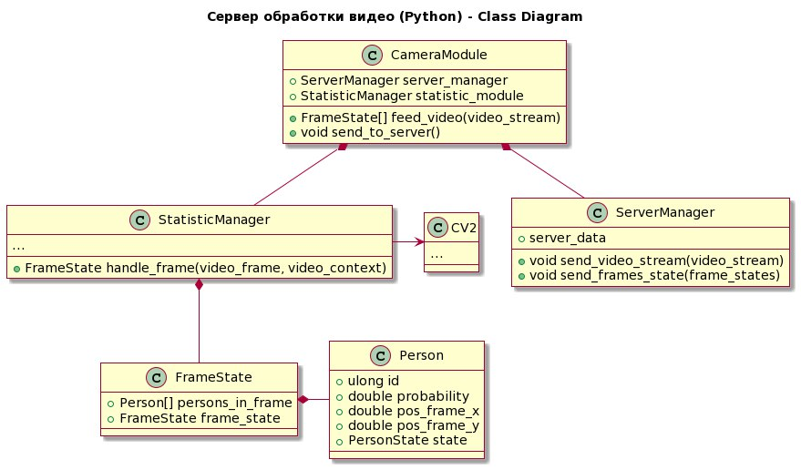
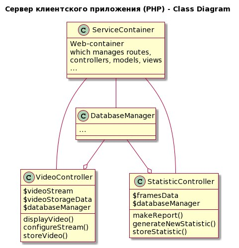
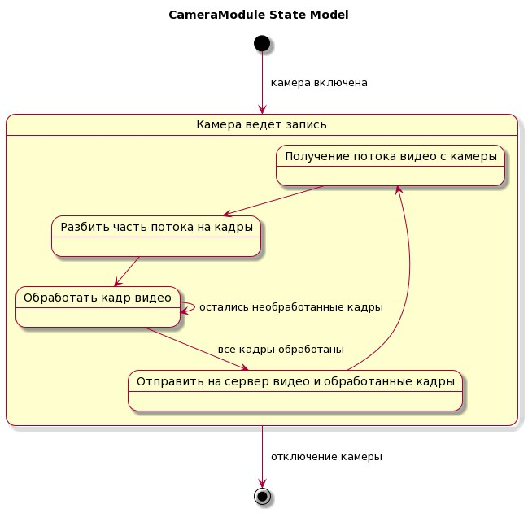

# Архитектура разрабатываемой системы
Архитектура системы представляет собой встроенную систему
(видеокамера + сервер обработки видео (Python)) и прилагающийся
к ней веб-интерфейс, осуществляющий хранение, дополнительный анализ
и отображение полученной информации с видеокамеры и статистики, сгенерированной
посредством искусственного интеллекта с сервера обработки видео.

### Диаграмма развертывания

### Диаграмма последовательности #1

### Диаграмма последовательности #2

### Диаграмма классов #1

### Диаграмма классов #2

### Диаграмма состояний

